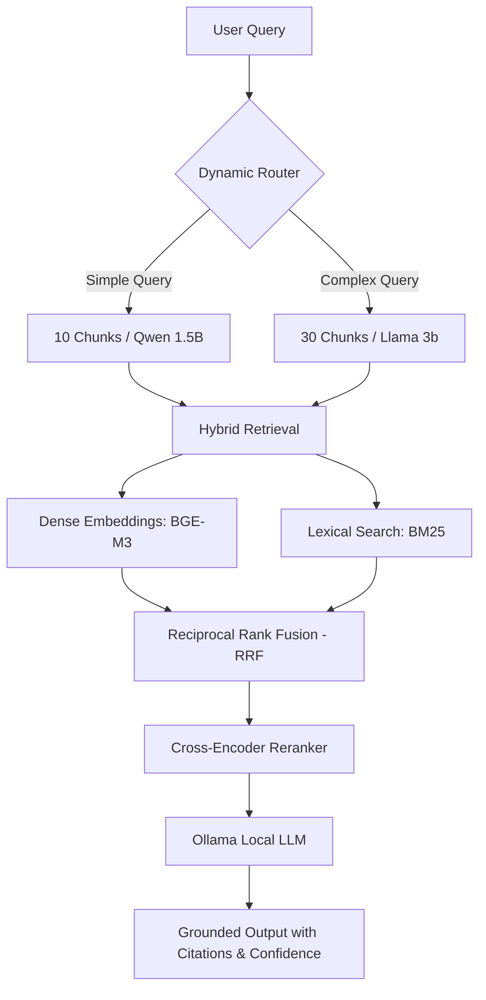
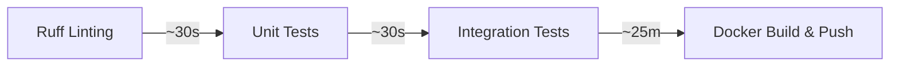

# 📈 Financial Document RAG System
 
[](https://python.org)
[](https://fastapi.tiangolo.com)
[](https://ollama.com)
[](https://www.docker.com)
[](https://github.com/rohit-577/rag-ci-cd/actions/workflows/ci-cd.yml)
 
A enterprise-grade, multi-stage **Retrieval-Augmented Generation (RAG)** pipeline purpose-built for querying highly structured financial data (`PDF`, `CSV`, `TXT`). Run entirely locally via Ollama with full CI/CD automation, production-grade test suites, and strict source citation parsing.
 
---
 
## ⚡ What Makes This Project Unique?
 
Most standard RAG implementations are simple "Vector Search + Prompt" wrappers that fail on real-world financial documents. This architecture is engineered differently to tackle complex data challenges:
 
*   **Hybrid Semantic & Lexical Search:** Standard vector databases miss exact alpha-numeric strings (e.g., specific transaction IDs, revenue figures). We use **Reciprocal Rank Fusion (RRF)** to fuse semantic dense embeddings (`BGE-M3`) with classic `BM25` lexical matching.
*   **Dynamic Query Routing:** Saves massive computing overhead by evaluating query intent. Simple questions route to ultra-fast models (`Qwen-2.5-1.5B`); complex multi-document comparisons route to capable models (`Llama-3.2-3B`).
*   **Dual-Stage Relevance Filters:** Top candidates undergo high-precision rescoring via a **Cross-Encoder Reranker**, eliminating irrelevant noise before it reaches the LLM context window.
*   **Hardened Financial Guardrails:** Explains *why* an answer was generated using structured source citations, a strict multi-point confidence metric, and automated truth-grounding evaluation.
*   **Ship-Ready Engineering Discipline:** Not just a notebook experiment — a staged CI/CD pipeline gates every change with linting, 141 unit tests, and 20 live-LLM integration tests before a Docker image is ever built or pushed.
 
---
 
## ⚙️ Architecture & Core Workflow
 
The system processes queries through an advanced, self-correcting ingestion and inference workflow:
 
### 1. System Processing Flow
 

 
### 2. Operational Pipeline Breakdowns
 
| Stage | Mechanism | Strategic Purpose |
| :--- | :--- | :--- |
| **1. Routing** | Intelligent Intent Classifier | Triage engine separating `simple` or `complex` queries to maximize system throughput. |
| **2. Retrieval** | Dense Vector + BM25 Fusion | Ensures both macro-contextual meaning and exact financial figures are captured. |
| **3. Reranking** | Cross-Encoder Scoring | Re-evaluates chunk context pairs to discard edge-case text fragments. |
| **4. Generation** | Context-Grounded Local LLM | Enforces generation boundaries to prevent hallucination by demanding visible string citations. |
 
---
 
## 🚀 Quick Start
 
### Prerequisites
 
*   Python 3.12+ installed
*   [Ollama Engine](https://ollama.com) running locally with target dependencies downloaded:
 
```bash
ollama pull llama3.2:3b
ollama pull qwen2.5:1.5b
```
 
### 1. Environment Setup
 
```bash
# Clone repository
git clone https://github.com/rohit-577/rag-ci-cd.git
cd rag-ci-cd
 
# Configure virtual environment
python -m venv .venv
source .venv/bin/activate
 
# Install editable development version
pip install -e ".[dev]"
```
 
### 2. Ingestion & Search Index Generation
Processes, parses, chunks, and builds semantic vector stores for all 30 financial records located inside the `docs/` folder.
```bash
make index
```
 
### 3. Launch Core Service API
```bash
make serve
# Service boots instantly at http://localhost:6565
```
 
### 4. Execute Real-Time Queries
```bash
curl -X POST http://localhost:6565/query \
  -H "Content-Type: application/json" \
  -d '{"query": "What is the capital of India?", "top_k": 10}'
```
 
---
 
## 📊 API Specification
 
### Endpoints Overview
 
| Method | Path | Description |
| :--- | :--- | :--- |
| `GET` | `/health` | Returns infrastructure health and global document chunk matrix counts. |
| `POST` | `/query` | Executes multi-stage retrieval over indexes to generate a validated response. |
| `GET` | `/documents` | Returns names of all verified, parsed files inside the active workspace. |
 
### Sample Interface Payload
 
`POST /query`
```json
{
  "query": "Compare revenue trends across documents",
  "top_k": 15,
  "rerank": true,
  "route": null
}
```
 
`Response (200 OK)`
```json
{
  "query": "Compare revenue trends across documents",
  "answer": "According to the corporate financial declarations...",
  "citations": [
    {
      "chunk_id": "chk_9842_a", 
      "filename": "DOC-1_ALBERT.txt", 
      "excerpt": "Q3 Topline Revenue expanded 14% year-over-year..."
    }
  ],
  "confidence": 0.94,
  "sufficiency": "sufficient",
  "route": "complex",
  "retrieval_time_ms": 150.0,
  "generation_time_ms": 2500.0
}
```
 
---
 
## 🤖 Automated CI/CD Pipeline
 
The project implements a **zero-trust, staged continuous integration pipeline** — nothing reaches `main`, and no Docker image is ever built, without first surviving lint checks, a full unit test suite, and a live-model integration run. Every push and pull request triggers this pipeline automatically:
 

 
### Why It's Staged This Way
 
The pipeline is deliberately ordered **cheapest and fastest first**. Lint and unit tests give feedback in under a minute on *every* push and PR, so contributors aren't blocked waiting on the expensive stuff for routine changes. The 25-minute integration suite — which requires pulling live Ollama models and running real inference — only fires once code actually merges into `main`, and the Docker image is only built and published *after* that integration run passes. This means a broken or hallucinating pipeline can never be silently shipped as a container image.
 
### Workflow Execution Strategy
 
| Action Job | Trigger Constraints | Operational Scope |
| :--- | :--- | :--- |
| **Lint** | Every Push / PR | Executes style consistency checking via `ruff check` & `ruff format`. |
| **Unit Tests** | Every Push / PR | Rapidly fires **141 automated mock tests** (~30 seconds execution window), no live LLM required. |
| **Integration Tests**| `main` Branch Merges | Deploys live Ollama workers, pulls models, runs **20 Gold-Set edge cases** against the real pipeline. |
| **Docker Build & Push** | Success on Integration | Builds a production multi-stage image, tags it with both the commit SHA and `latest`, and uploads securely to `ghcr.io`. |
 
### Governance & Safety Nets
 
*   **Branch Protection:** `main` is configured to require the Lint and Unit Test status checks to pass before any pull request can be merged — broken code physically cannot land on `main`.
*   **Immutable, Traceable Builds:** Every published Docker image is tagged with its exact commit SHA (in addition to `latest`), so any deployed container can be traced back to the precise commit, tests, and integration run that produced it.
*   **Fail-Safe Integration Runs:** Integration tests auto-skip on Ollama connectivity timeouts rather than poisoning the whole suite with infrastructure flakiness — a failure here reflects the *model's* output quality, not a flaky runner.
*   **Zero Manual Deployment Steps:** From `git push` to a pushed, pull-able container image on `ghcr.io`, the entire path is automated — no manual builds, no "works on my machine" deploys.
 
---
 
## 🧪 Advanced Validation Test Suite
 
This engine includes a thorough, multi-tier automated software test matrix:
 
### 141 Unit Tests
*   **Ingestion:** Ensures parsing mechanics handle broken structures across CSV arrays and raw binary stream strings.
*   **Retrieval:** Validates matrix array alignment mathematical stability during RRF computation runs.
*   **Generation:** Confirms confidence scores parse correctly under erratic token output conditions.
 
### 20 Integration "Gold Set" Tests
*   **10 Simple Targets:** Direct single-document extraction parameters validation.
*   **6 Complex Frameworks:** Cross-document analytical evaluation requiring join logic (multi-document filtering and row aggregations).
*   **4 Extreme Matrices:** Massive multi-document calculations assessing boundaries like historical peak-to-trough trends.
*   *Note: Includes a fail-safe auto-skip if local Ollama engines hit connectivity timeouts.*
 
---
 
## 🛠️ Complete Makefile Cheat Sheet
 
| Command Target | Purpose Execution Path |
| :--- | :--- |
| `make lint` | Run strict styling syntax evaluation checks. |
| `make format` | Automatically fix and format python source files. |
| `make test` | Run all fast 141 unit tests locally. |
| `make test-integration` | Execute the intensive 167 global integration testing harness. |
| `make index` | Scan `docs/` and generate persistent structural knowledge directories. |
| `make serve` | Initialize FastAPI production-ready listening port loop. |
| `make eval` | Fire deep retrieval quality evaluations. |
| `make docker-build` | Construct clean, multi-stage runtime container images. |
| `make docker-run` | Launch locally built container applications instantly. |
